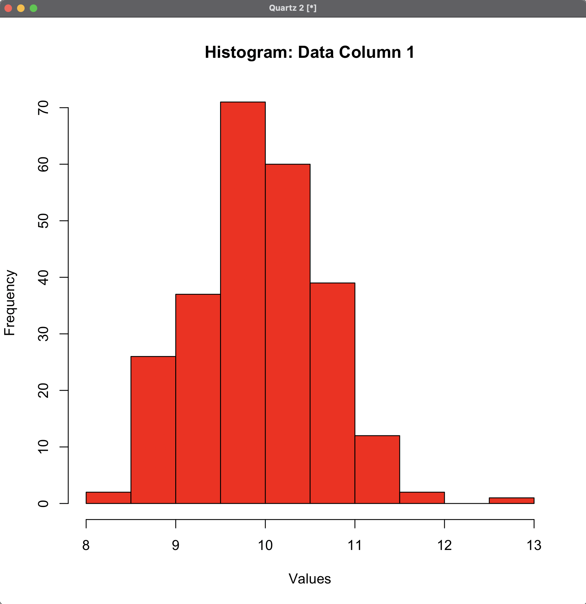
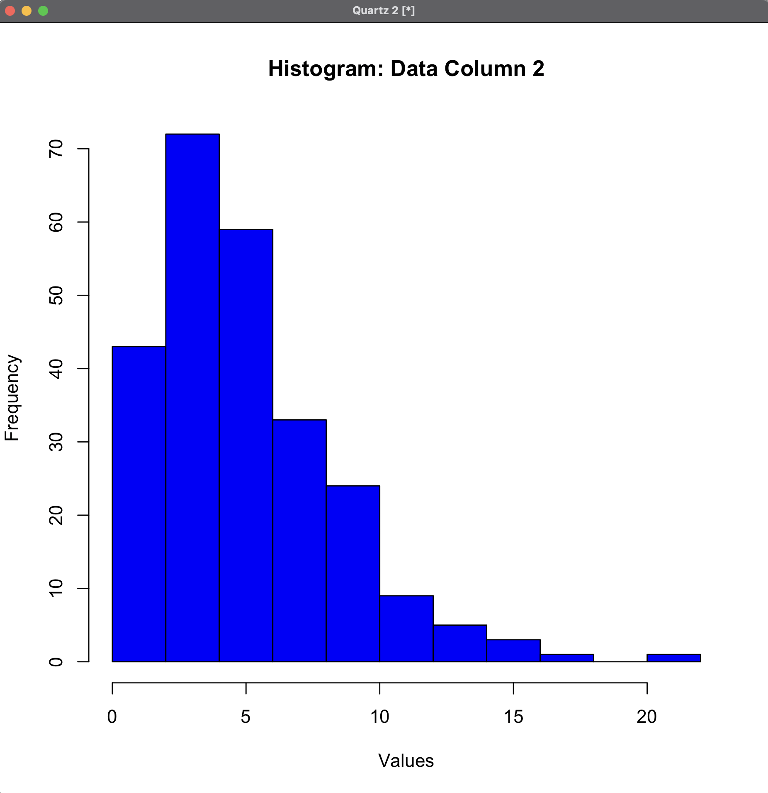
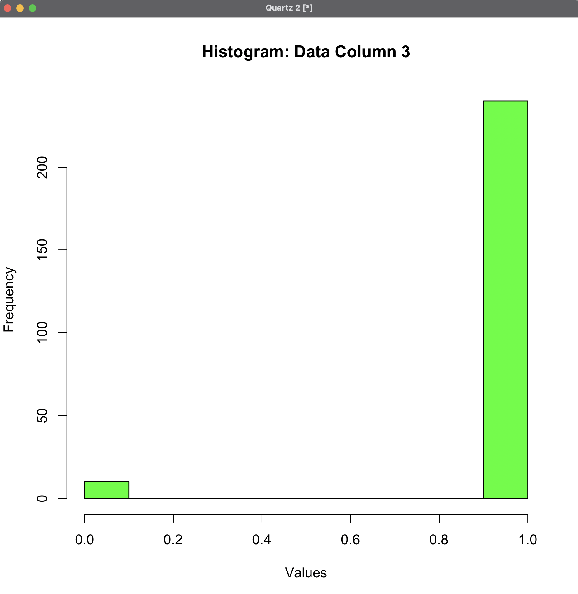

# Manufacturing Data Analytics tool

## Overview
This repository contains the solutions and analysis for the CMTH380 project. The project involves statistical analysis of three data samples using various statistical techniques, including histogram visualization, confidence interval estimation, and hypothesis testing.

## Data
The dataset consists of three samples, which are provided in the file `data.txt`. The data is also available in an Excel file for convenience. The analysis is performed in R, but any programming language can be used.

## Requirements
To run the analysis in R, you may need the following libraries:
- `ggplot2`
- `stats`
- `dplyr`

## Analysis
### Part A: Histogram, Mean, and Variance
For each sample:
- Histogram was plotted.
- Sample mean and variance were calculated.

| Sample   | Mean       | Variance  |
|----------|-----------|------------|
| Sample 1 | 9.934069  | 0.5019804  |
| Sample 2 | 9.934069  | 0.5019804  |
| Sample 3 | 0.96      | 0.03855422 |

### Histograms

#### Sample 1

#### Sample 2

#### Sample 3

### Part B: Confidence Interval and Hypothesis Testing
For Sample 1:
- **99% Confidence Interval for Mean**: (9.817755, 10.05038)
- **Hypothesis Test**: Testing H0: \\(\\sigma^2 = 0.5\\) vs H1: \\(\\sigma^2 \\neq 0.5\\)
  - p-value = 0.4705026 (fails to reject null hypothesis)

### Part C: Hypothesis Test for Defective Parts
- Testing H0: \\(p \\geq 0.10\\) vs H1: \\(p < 0.10\\)
  - p-value = 0.00078 (rejects null hypothesis)
  - Conclusion: The proportion of defective parts is significantly less than 10%.
